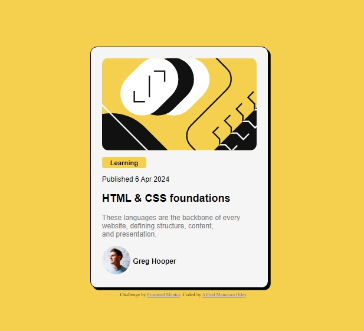

# Frontend Mentor - Blog preview card solution

This is my solution to the [Blog preview card challenge on Frontend Mentor](https://www.frontendmentor.io/challenges/blog-preview-card-ckPaj01IcS). Frontend Mentor challenges help you improve your coding skills by building realistic projects. 

## Table of contents

- [Overview](#overview)
  - [The challenge](#the-challenge)
  - [Screenshot](#screenshot)
  - [Links](#links)
- [My process](#my-process)
  - [Built with](#built-with)
  - [What I learned](#what-i-learned)
  - [Continued development](#continued-development)
  - [Author](#author)
- [Acknowledgments](#acknowledgments)

## Overview

### The challenge

Users should be able to:

- See hover and focus states for all interactive elements on the page.

### Screenshot



I have added a screenshot of my solution.

### Links

- Solution URL: [Add solution URL here](https://your-solution-url.com)
- Live Site URL: [Add live site URL here](https://your-live-site-url.com)

## My process

I looked at the sample design multiple times to be able to closely design a copy of it.

### Built with

- Semantic HTML5 markup
- CSS

### What I learned

I learned about the 'hover' CSS property.
It is what I used to make the card have a shadow once the cursor is placed on it.

```CSS
header:hover {
    box-shadow: 5px 5px;
    border: solid 1px;
}
```

### Continued development

I still need to learn more about CSS, especially Flexbox and Grid.

## Author

- Frontend Mentor - [@AlfredOdey](https://www.frontendmentor.io/profile/AlfredOdey)


## Acknowledgments

I solved this challenge alone.
